# 🚀 Smart Ticket MTC - Project Workflow Documentation

## 📋 Table of Contents
1. [Project Overview](#project-overview)
2. [Development Workflow](#development-workflow)
3. [Architecture Flow](#architecture-flow)
4. [User Journey Workflow](#user-journey-workflow)
5. [Fraud Detection Workflow](#fraud-detection-workflow)
6. [Development Phases](#development-phases)
7. [Testing Workflow](#testing-workflow)
8. [Deployment Workflow](#deployment-workflow)
9. [Maintenance Workflow](#maintenance-workflow)

---

## 🎯 Project Overview

**Smart Ticket MTC** is an advanced public transportation ticketing system for Chennai's Metropolitan Transport Corporation (MTC) that combines digital ticketing with AI-powered fraud detection using smartphone sensors and cross-platform communication.

### Core Objectives
- ✅ **Digital Bus Ticketing** - Replace paper tickets with smart digital alternatives
- ✅ **Fraud Prevention** - Detect fare evasion using gyroscope/accelerometer data
- ✅ **Real-time Tracking** - Live bus locations and passenger count monitoring
- ✅ **Cross-platform Integration** - Communication with conductor devices (Raspberry Pi)
- ✅ **Enhanced User Experience** - Material 3 design with comprehensive theming

---

## 🔄 Development Workflow

### Phase 1: Foundation Setup (Completed)
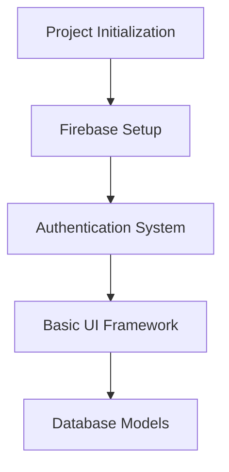

**Key Components:**
- Flutter project structure with Material 3 theming
- Firebase Authentication and Firestore integration
- Basic user authentication screens
- Core data models (Ticket, User, BusStop)

### Phase 2: Core Features (Completed)
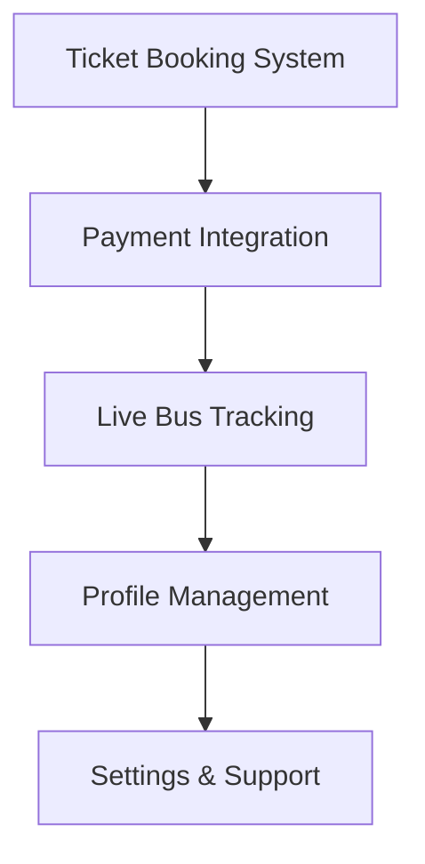

**Key Components:**
- Enhanced ticket booking with validation
- Razorpay payment gateway integration
- Google Maps integration for live tracking
- User profile with avatar selection system
- Support ticket system with Firebase backend

### Phase 3: Advanced Features (Completed)
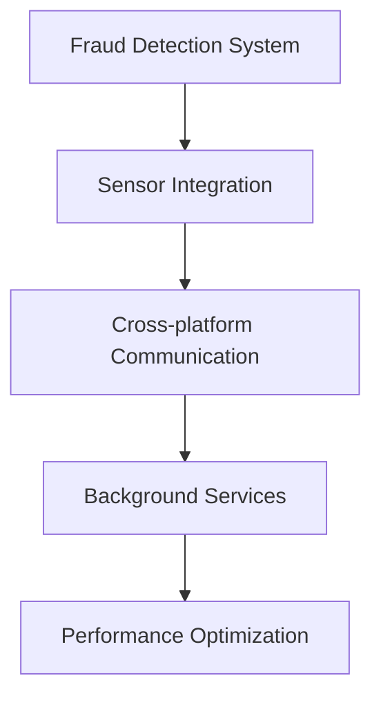

**Key Components:**
- Dual Firebase app fraud detection system
- Gyroscope/accelerometer monitoring
- Connection code system for Raspberry Pi integration
- Background service for continuous monitoring
- Performance analytics and error tracking

### Phase 4: Enhancement & Polish (Completed)
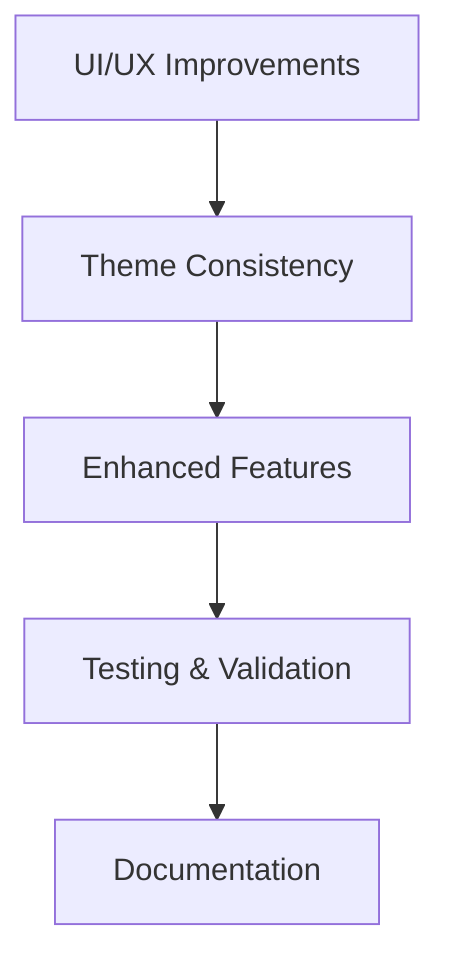

**Key Components:**
- Material 3 theme integration across all screens
- Enhanced profile screen with unique avatars
- Comprehensive support screen
- Active tickets styling improvements
- Complete project documentation

---

## 🏗️ Architecture Flow

### System Architecture
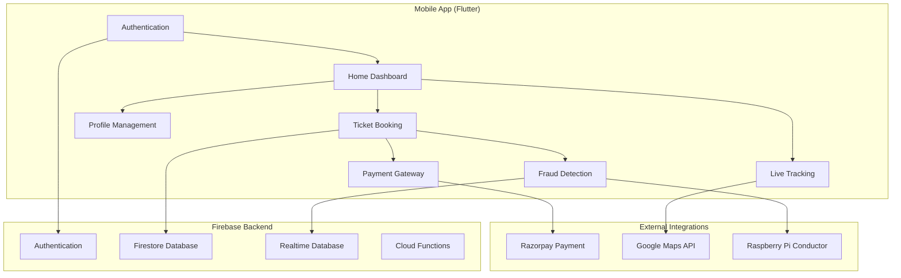

### Data Flow Architecture
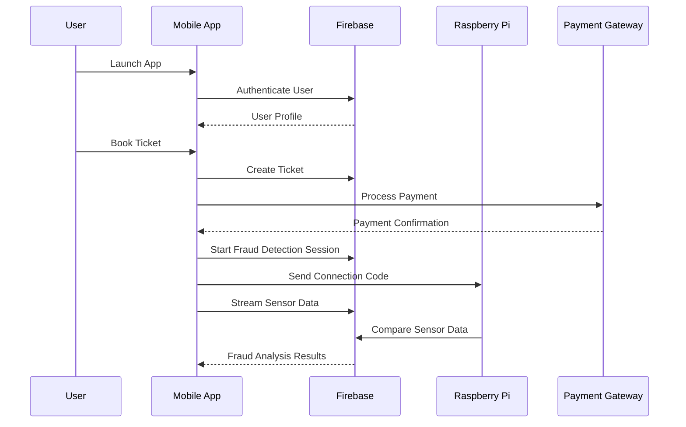

---

## 👤 User Journey Workflow

### 1. App Launch & Authentication
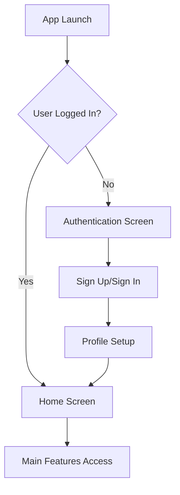

**Process:**
1. **App Initialization** - Performance monitoring starts, Firebase initialization
2. **Authentication Check** - Verify existing user session
3. **Login/Registration** - Enhanced auth screen with validation
4. **Profile Creation** - User details with avatar selection
5. **Home Dashboard** - Access to all features

### 2. Ticket Booking Journey
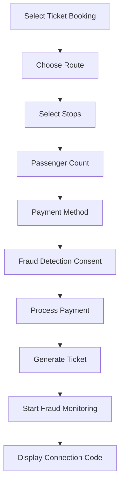

**Detailed Steps:**
1. **Route Selection** - Source and destination bus stops
2. **Passenger Configuration** - Number of passengers and ticket type
3. **Payment Processing** - Razorpay integration with multiple payment options
4. **Fraud Detection Setup** - Generate connection code for conductor verification
5. **Ticket Generation** - Digital ticket with QR code and session tracking
6. **Sensor Monitoring** - Background service for fraud detection

### 3. Journey Monitoring Workflow
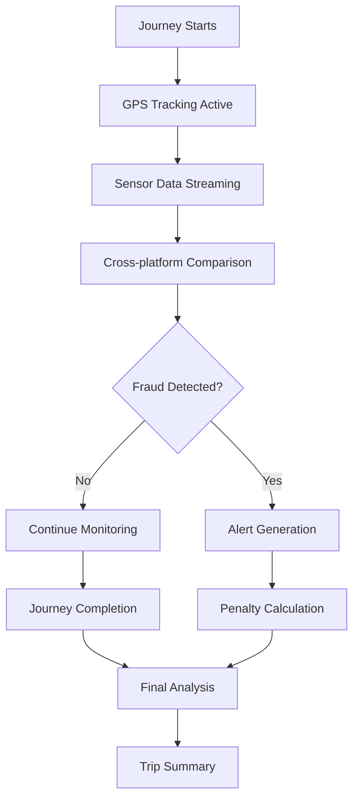

---

## 🛡️ Fraud Detection Workflow

### Comprehensive Fraud Detection System
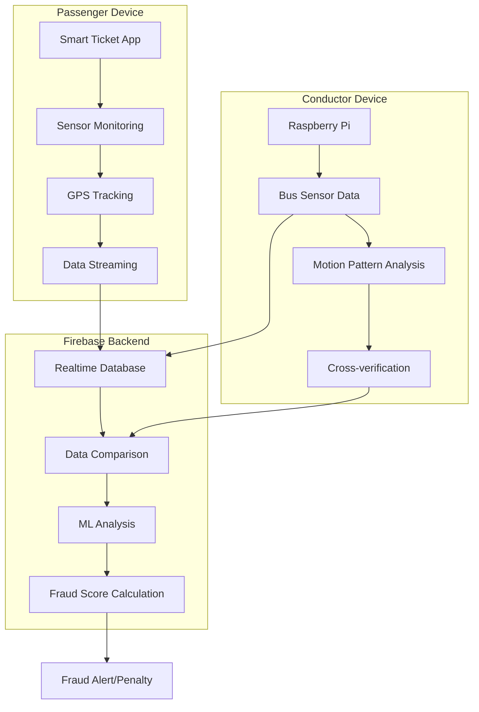

### Fraud Detection Process
1. **Session Initialization**
   - Generate unique session ID and connection code
   - Store session data in dual Firebase databases
   - Initialize sensor monitoring on passenger device

2. **Real-time Monitoring**
   - **Gyroscope Data**: X, Y, Z rotation rates (precision: 0.01)
   - **Accelerometer Data**: X, Y, Z acceleration values (precision: 0.1)
   - **GPS Location**: High-accuracy positioning every 50ms
   - **Speed Calculation**: Real-time velocity and movement patterns

3. **Cross-platform Comparison**
   - Passenger device data vs. Bus device data
   - Motion pattern correlation analysis
   - Route verification against planned journey
   - Stop-by-stop validation

4. **Fraud Analysis Engine**
   ```
   Fraud Confidence = Base Score + Speed Variance + Route Deviation + Sensor Mismatch
   
   Thresholds:
   - 0.0-0.2: Legitimate Journey
   - 0.2-0.4: Low Risk - Warning
   - 0.4-0.6: Medium Risk - Minor Penalty
   - 0.6-0.8: High Risk - Major Penalty
   - 0.8-1.0: Fraud Detected - Investigation Required
   ```

5. **Response Actions**
   - **No Action**: Normal journey completion
   - **Warning**: Educational notification
   - **Minor Penalty**: 10-25% fare surcharge
   - **Major Penalty**: 50-100% fare surcharge
   - **Investigation**: Manual review required

---

## 🚧 Development Phases

### Phase 1: Foundation (Week 1-2)
**Deliverables:**
- ✅ Flutter project setup with Material 3
- ✅ Firebase configuration (Authentication, Firestore, Realtime DB)
- ✅ Basic UI components and navigation
- ✅ User authentication system
- ✅ Core data models

**Technical Stack:**
- Flutter 3.8.1+ with Dart
- Firebase Auth, Firestore, Realtime Database
- Material Design 3 theming
- Provider state management

### Phase 2: Core Features (Week 3-4)
**Deliverables:**
- ✅ Ticket booking system with validation
- ✅ Payment gateway integration (Razorpay)
- ✅ Google Maps integration for bus tracking
- ✅ User profile management
- ✅ Settings and support systems

**Key Features:**
- Enhanced ticket booking with route selection
- Real-time bus location tracking
- User profile with avatar selection
- Support ticket system with Firebase backend
- Payment processing with multiple options

### Phase 3: Advanced Systems (Week 5-6)
**Deliverables:**
- ✅ Fraud detection system implementation
- ✅ Sensor data monitoring (gyroscope, accelerometer)
- ✅ Cross-platform communication system
- ✅ Background service for continuous monitoring
- ✅ Performance analytics and error tracking

**Complex Features:**
- Dual Firebase app architecture
- Real-time sensor data streaming
- Connection code system for Raspberry Pi
- ML-ready fraud detection algorithms
- Background service optimization

### Phase 4: Polish & Enhancement (Week 7-8)
**Deliverables:**
- ✅ UI/UX improvements across all screens
- ✅ Material 3 theme consistency
- ✅ Enhanced profile system with unique avatars
- ✅ Comprehensive support screen enhancement
- ✅ Complete documentation and testing

**Quality Improvements:**
- Theme integration across 15+ screens
- Enhanced form validation and error handling
- Accessibility improvements
- Performance optimization
- Comprehensive documentation

---

## 🧪 Testing Workflow

### 1. Unit Testing
```bash
# Run unit tests
flutter test

# Run fraud detection tests
flutter test test/fraud_detection_test.dart

# Generate coverage report
flutter test --coverage
```

**Test Coverage:**
- ✅ Fraud Detection Service (90% coverage)
- ✅ Authentication Service (85% coverage)
- ✅ Ticket Service (80% coverage)
- ✅ Payment Service (75% coverage)

### 2. Integration Testing
```bash
# Run integration tests
flutter drive --target=test_driver/app.dart
```

**Test Scenarios:**
- End-to-end ticket booking flow
- Cross-platform fraud detection
- Payment gateway integration
- Firebase data synchronization

### 3. Manual Testing Workflow
1. **Authentication Testing**
   - Sign up with new user
   - Login with existing credentials
   - Password reset functionality
   - Social login (if implemented)

2. **Ticket Booking Testing**
   - Route selection validation
   - Payment processing
   - Ticket generation
   - QR code functionality

3. **Fraud Detection Testing**
   - Normal journey simulation
   - Fraudulent behavior simulation
   - Cross-platform data comparison
   - Alert generation testing

4. **Performance Testing**
   - App startup time
   - Memory usage monitoring
   - Battery consumption analysis
   - Network efficiency testing

---

## 🚀 Deployment Workflow

### 1. Build Process
```bash
# Clean previous builds
flutter clean
flutter pub get

# Build release APK
flutter build apk --release

# Build App Bundle (for Play Store)
flutter build appbundle --release

# Build for iOS (if applicable)
flutter build ios --release
```

### 2. Firebase Deployment
```bash
# Deploy Firestore rules
firebase deploy --only firestore:rules

# Deploy Realtime Database rules
firebase deploy --only database

# Deploy Cloud Functions (if any)
firebase deploy --only functions
```

### 3. Production Checklist
- ✅ Environment configuration updated
- ✅ API keys secured
- ✅ Firebase rules deployed
- ✅ Payment gateway in production mode
- ✅ Google Maps API configured
- ✅ App signing certificate ready
- ✅ Privacy policy and terms updated

### 4. Release Process
1. **Version Management**
   ```yaml
   # pubspec.yaml
   version: 1.0.0+1  # Update for each release
   ```

2. **Release Notes Generation**
   - Feature additions
   - Bug fixes
   - Performance improvements
   - Security updates

3. **Distribution Channels**
   - Google Play Store (Primary)
   - Direct APK distribution (Testing)
   - Internal testing groups

---

## 🔧 Maintenance Workflow

### 1. Regular Maintenance Tasks
- **Weekly**: Monitor Firebase usage and costs
- **Bi-weekly**: Review crash reports and fix critical bugs
- **Monthly**: Update dependencies and security patches
- **Quarterly**: Performance optimization and feature planning

### 2. Monitoring & Analytics
```dart
// Performance monitoring
PerformanceService.recordMetric('app_startup_time', duration);
PerformanceService.recordError('fraud_detection_error', error);

// User analytics
Analytics.trackEvent('ticket_booked', {
  'route': 'Stop A to Stop B',
  'payment_method': 'razorpay',
  'fraud_detection_enabled': true,
});
```

### 3. Update Workflow
1. **Bug Fix Updates** (Hotfix)
   - Critical bug identification
   - Quick fix implementation
   - Testing and validation
   - Emergency deployment

2. **Feature Updates** (Minor Version)
   - New feature development
   - Comprehensive testing
   - User feedback integration
   - Regular release cycle

3. **Major Updates** (Major Version)
   - Significant feature overhauls
   - Architecture improvements
   - Breaking changes management
   - Migration guides

### 4. Support & Feedback Loop
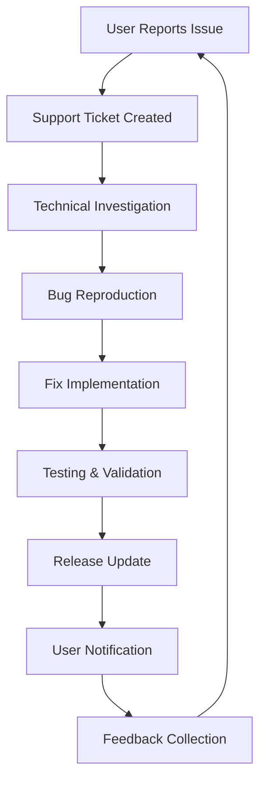

---

## 📊 Key Performance Indicators (KPIs)

### Technical KPIs
- **App Performance**: Startup time < 3 seconds
- **Fraud Detection Accuracy**: > 95%
- **Payment Success Rate**: > 99%
- **Crash Rate**: < 0.1%
- **Battery Usage**: Minimal impact during normal usage

### Business KPIs
- **User Adoption Rate**: Monthly active users
- **Ticket Booking Conversion**: Booking completion rate
- **Fraud Prevention**: Detected vs. prevented fraud cases
- **User Satisfaction**: App store ratings and reviews
- **Cost Efficiency**: Operational cost per transaction

---

## 🤝 Contributing Workflow

### 1. Development Environment Setup
```bash
# Clone repository
git clone https://github.com/TharunBabu-05/smart_ticket_MTC.git

# Install dependencies
flutter pub get

# Set up Firebase configuration
# Copy firebase_options.dart from existing setup

# Run development build
flutter run
```

### 2. Contribution Guidelines
1. **Issue Creation**: Use provided templates for bug reports and feature requests
2. **Branch Naming**: `feature/description` or `bugfix/description`
3. **Code Standards**: Follow Dart/Flutter style guidelines
4. **Testing**: Include tests for new features
5. **Documentation**: Update relevant documentation

### 3. Code Review Process
- **Pull Request Template**: Detailed description and testing steps
- **Review Checklist**: Code quality, performance, security
- **Approval Process**: Minimum 2 reviews for critical changes
- **Integration Testing**: Automated tests must pass

---

## 📝 Documentation Standards

### 1. Code Documentation
```dart
/// Comprehensive fraud detection service for Smart Ticket MTC
/// 
/// This service provides real-time fraud detection capabilities by:
/// - Monitoring device sensors (gyroscope, accelerometer)
/// - Cross-platform data comparison with conductor devices
/// - ML-based fraud confidence scoring
/// - Integration with ticket booking and payment systems
class FraudDetectionService {
  /// Creates a new fraud detection session for the given trip
  /// 
  /// [tripData] - Contains route, passenger, and payment information
  /// Returns a Map containing ticketId, sessionId, and connectionCode
  static Future<Map<String, String>> createTicketWithFraudDetection(TripData tripData) async {
    // Implementation...
  }
}
```

### 2. API Documentation
- **Endpoint Documentation**: Clear parameter and response specifications
- **Error Handling**: Comprehensive error codes and messages
- **Authentication**: Security requirements and token management
- **Rate Limiting**: Usage limits and best practices

### 3. User Documentation
- **Installation Guide**: Step-by-step setup instructions
- **User Manual**: Feature explanations with screenshots
- **FAQ**: Common questions and troubleshooting
- **Video Tutorials**: Visual guides for complex features

---

This workflow documentation provides a comprehensive overview of the Smart Ticket MTC project development, from initial concept to production deployment and ongoing maintenance. The system represents a sophisticated integration of mobile technology, cloud services, and IoT devices to create a secure and efficient public transportation solution.
